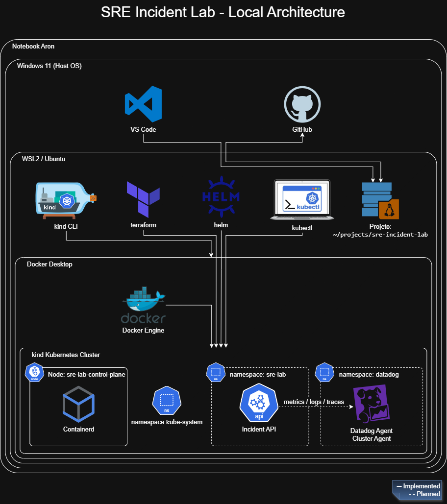

# SRE Incident Lab — Local Architecture

## Overview

The SRE Incident Lab runs locally on a Windows 11 notebook using WSL2,
Docker Desktop and a single-node kind Kubernetes cluster.

The architecture was intentionally designed to keep the laboratory lightweight,
reproducible and initially free of cloud infrastructure costs.

## Current environment

The components currently implemented are:

- Windows 11 as the host operating system;
- WSL2 with Ubuntu as the development environment;
- Docker Desktop as the container platform;
- kind for the local Kubernetes cluster;
- a single Kubernetes node named `sre-lab-control-plane`;
- kubectl for cluster administration;
- Helm for application packaging and release management;
- Terraform for infrastructure and platform automation.

## Planned application architecture

The application workload will be isolated in the `sre-lab` namespace.

Planned components include:

- Incident API;
- Kubernetes Deployment and Service;
- health probes;
- resource requests and limits;
- Horizontal Pod Autoscaler;
- Datadog monitoring and observability components.

## Observability

Datadog will be introduced later in the project to collect and correlate:

- infrastructure metrics;
- Kubernetes metrics and events;
- application logs;
- application traces;
- alerts and SLO information.

The Datadog trial will only be activated during the observability phase of the
project.

## Diagram convention

Solid lines represent components that are already implemented.

Dashed lines represent components planned for later phases of the project.

## Editable source

The editable diagrams.net source is available at:

`docs/diagrams/sre-incident-lab-architecture.drawio`
